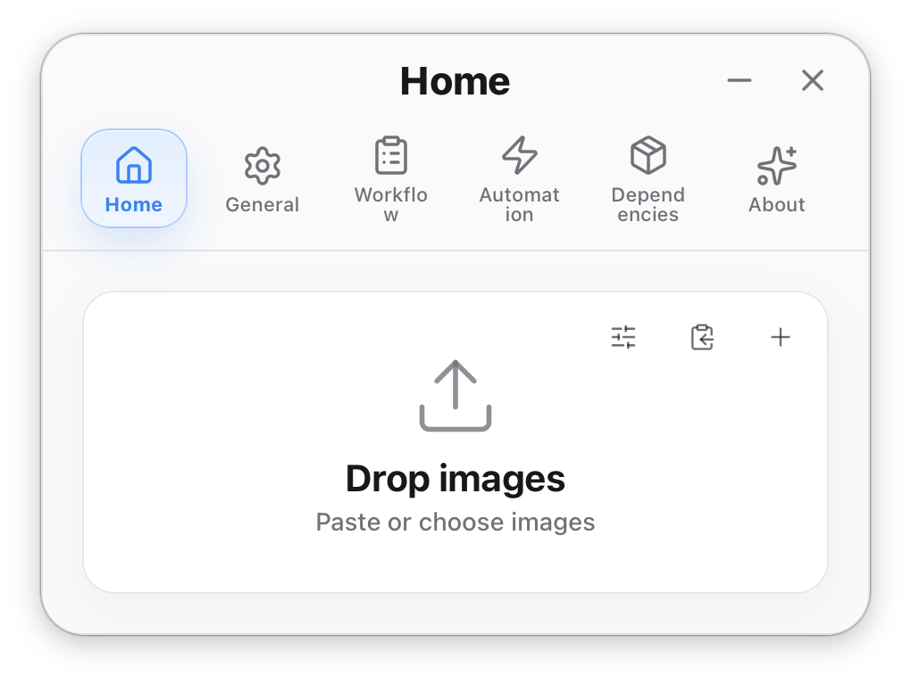
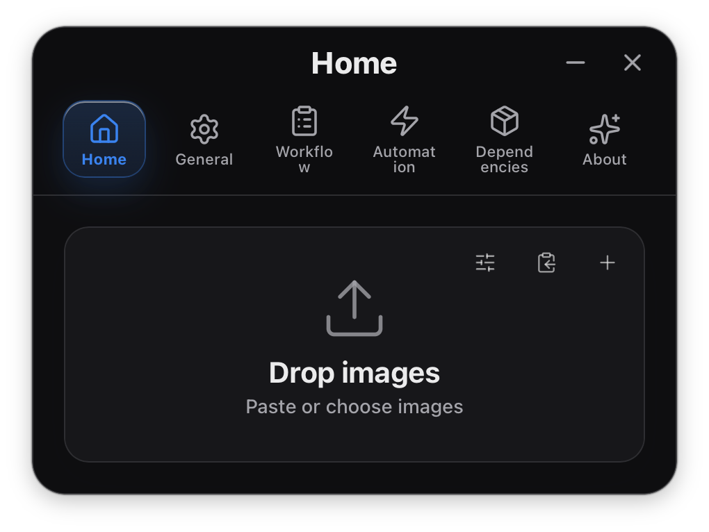

<p align="center">
  
</p>

<h1 align="center">zipax</h1>

<p align="center">
  <a href="#english">English</a>
  ·
  <a href="#中文">中文</a>
</p>

---

<h2 id="english">English</h2>

<p align="center">
  A lightweight image and PDF compression app powered by Tauri and Rust.
</p>

<p align="center">
  
  
  
  
  
</p>

<p align="center">
  <a href="https://github.com/2716190547/zipax/releases">Download</a>
  ·
  <a href="#features">Features</a>
  ·
  <a href="#build">Build</a>
  ·
  <a href="SUPPORT.md">Buy me a drink</a>
</p>

---

## Preview

| Light Mode | Dark Mode |
| --- | --- |
|  |  |

## What's New in v0.24.0

zipax v0.24.0 is a major code quality release that restructures both the Rust backend and the React frontend for better maintainability.

### Rust Core

- Reorganized `zipax-core`, `zipax-cli`, `src-tauri` into clear module boundaries.
- Extracted shared config parsing (`CompressionMode`, `OutputFormat`, `QualityLevel`) into core for app/CLI reuse.
- Split monolithic `commands.rs` into focused modules: `state`, `autostart`, `file_commands`, `watch_commands`, `tray_commands`, `compression_options`.

### Frontend

- Extracted global side effects into dedicated hooks (`useAppearanceMode`, `useDocumentLocale`, `useTraySync`, `useAutoUpdateCheck`, `useAutostartRefresh`).
- Unified update check flow with `useUpdateCheck`.
- Split `GeneralView` settings page into focused setting components.
- Layered `ManualCompression` into input zone, compression queue, result list, and action bar.
- Organized global CSS into structured `styles/` directory.
- Clarified Zustand store with typed slices and proper partialize.

### Infrastructure

- Full CI/CD release workflow via GitHub Actions (macOS, Windows, Linux).
- Auto-update support via `tauri-plugin-updater`.

## Features

- Manual image/PDF compression.
- Drag-and-drop, paste, and file picker entry points.
- Folder automation for newly added files.
- JPEG, PNG, WebP, AVIF, HEIC, TIFF, and PDF workflows where supported.
- Compression modes: high quality, balanced, small size, advanced, and target size.
- Workflow options: overwrite original, skip already compressed files, copy after compression, preserve metadata, and resize limits.
- Rust-based planning and compression commands shared by the desktop app and CLI.
- Compact light/dark UI with automatic content-sized desktop windows.

## Project Structure

- `zipax-cross/src`: React desktop UI, hooks, store, and styles.
- `zipax-cross/src-tauri`: Tauri shell, desktop commands, and plugin integration.
- `zipax-cross/crates/zipax-core`: shared Rust compression core and config parsing.
- `zipax-cross/crates/zipax-cli`: CLI entry for testing and automation.

## Build

Desktop app:

```bash
cd zipax-cross
npm ci
npm run build
npx tauri build
```

Rust core and CLI:

```bash
cd zipax-cross
cargo test
cargo run -q -p zipax-cli -- plan photo.jpg
cargo run -q -p zipax-cli -- compress photo.jpg --level 4
cargo run -q -p zipax-cli -- compress photo.jpg --output-format avif --level 4
cargo run -q -p zipax-cli -- compress photo.jpg --max-width 128 --max-height 128
cargo run -q -p zipax-cli -- compress photo.png --level 4
cargo run -q -p zipax-cli -- plan photo.png --overwrite --output-format webp
cargo run -q -p zipax-cli -- compress photo.png --output-format webp --target-size-kb 500
cargo run -q -p zipax-cli -- compress a.png b.png --output-format webp
```

## Release

Pushing a version tag builds native app packages on GitHub Actions:

```bash
git tag v0.24.0
git push origin v0.24.0
```

The release workflow creates a draft GitHub Release with macOS, Windows, and Linux artifacts attached.

## Support

If zipax saves you a little time, there is a bilingual support page here: [Support zipax](SUPPORT.md).

---

<h2 id="中文">中文</h2>

<p align="center">
  基于 Tauri + Rust 的轻量级跨平台图像和 PDF 压缩工具。
</p>

<p align="center">
  
  
  
  
  
</p>

<p align="center">
  <a href="https://github.com/2716190547/zipax/releases">下载</a>
  ·
  <a href="#功能">功能</a>
  ·
  <a href="#构建">构建</a>
  ·
  <a href="SUPPORT.md">请我喝一杯</a>
</p>

---

## 预览

| 浅色模式 | 深色模式 |
| --- | --- |
|  |  |

## v0.24.0 更新内容

zipax v0.24.0 是一次大规模代码质量升级，重构了 Rust 后端和 React 前端架构。

### Rust 核心重构

- 重新划分 `zipax-core`、`zipax-cli`、`src-tauri` 三个模块的职责边界。
- 将压缩模式、输出格式、质量等级等解析规则下沉到 core，app 和 CLI 复用同一套逻辑。
- 将臃肿的 `commands.rs` 拆分为独立模块：`state`、`autostart`、`file_commands`、`watch_commands`、`tray_commands`、`compression_options`。

### 前端代码精简

- 将全局副作用（外观模式、语言方向、托盘同步、自动更新、启动项刷新）抽成独立 hooks。
- 统一更新检查流程，手动/自动检查共用 `useUpdateCheck`。
- 设置页拆分为多个独立组件，`GeneralView` 从 220 行精简到约 100 行。
- 手动压缩页拆分为：拖放区域、压缩队列、结果列表、操作栏。
- CSS 从单文件 1700+ 行整理为按功能分层的 `styles/` 目录。
- Zustand store 按职责分区，明确持久化字段和临时状态。

### 发布与更新

- GitHub Actions 全平台构建流水线（macOS / Windows / Linux）。
- 支持通过 Tauri updater 自动接收版本更新。

## 功能

- 手动图像/PDF 压缩。
- 拖放、粘贴和文件选择器入口。
- 自动监控文件夹中新增的文件并压缩。
- 支持的格式：JPEG、PNG、WebP、AVIF、HEIC、TIFF、PDF。
- 压缩模式：高质量、均衡、小文件、高级、目标大小。
- 工作流选项：覆盖原文件、跳过已压缩文件、压缩后复制、保留元数据、调整尺寸限制。
- 基于 Rust 的压缩规划和命令，桌面应用与 CLI 共享。
- 紧凑的浅色/深色界面，自动适应内容大小的桌面窗口。

## 项目结构

- `zipax-cross/src`：React 桌面 UI、hooks、store 和样式。
- `zipax-cross/src-tauri`：Tauri 外壳、桌面命令和插件集成。
- `zipax-cross/crates/zipax-core`：共享的 Rust 压缩核心和配置解析。
- `zipax-cross/crates/zipax-cli`：CLI 入口，用于测试和自动化。

## 构建

桌面应用：

```bash
cd zipax-cross
npm ci
npm run build
npx tauri build
```

Rust 核心和 CLI：

```bash
cd zipax-cross
cargo test
cargo run -q -p zipax-cli -- plan photo.jpg
cargo run -q -p zipax-cli -- compress photo.jpg --level 4
cargo run -q -p zipax-cli -- compress photo.jpg --output-format avif --level 4
cargo run -q -p zipax-cli -- compress photo.jpg --max-width 128 --max-height 128
cargo run -q -p zipax-cli -- compress photo.png --level 4
cargo run -q -p zipax-cli -- plan photo.png --overwrite --output-format webp
cargo run -q -p zipax-cli -- compress photo.png --output-format webp --target-size-kb 500
cargo run -q -p zipax-cli -- compress a.png b.png --output-format webp
```

## 版本发布

推送版本标签即可触发 GitHub Actions 构建原生安装包：

```bash
git tag v0.24.0
git push origin v0.24.0
```

GitHub Actions 的发布工作流会自动创建包含 macOS、Windows 和 Linux 构建产物的草稿 Release。

## 支持

如果 zipax 为你节省了一点时间，欢迎通过[支持 zipax](SUPPORT.md)页面支持项目继续维护。
